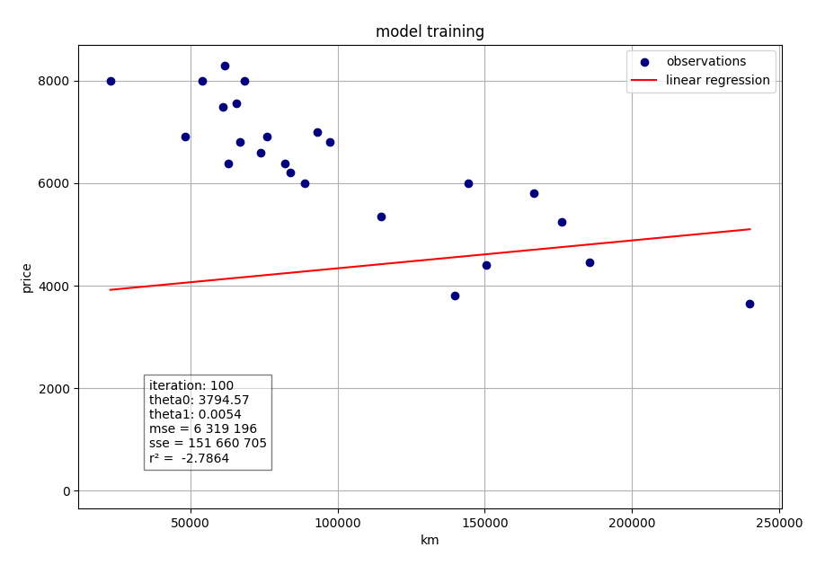

## ft_linear_regression

project École 42, where it is necessary to create a program that predicts the price of a car
using linear functional train with gradient descent algorithm.

implementation of linear regression with one observation - in this case, the mileage of the car.



### how to use

the first program is used to train the model.

it will read the dataset file.
the resulting coefficients are theta0 and
theta1 are saved for use in the second program.

```
python3 train_model.py data.csv -vis
```

the second program predicts the price of a car for a given mileage.

```
python3 predict_price.py <mileage>
```

optional arguments:

`-h` show help message and exit

`-lr` set learning rate

`-ep` set number of epochs to train

`-vis` show a linear regression plot